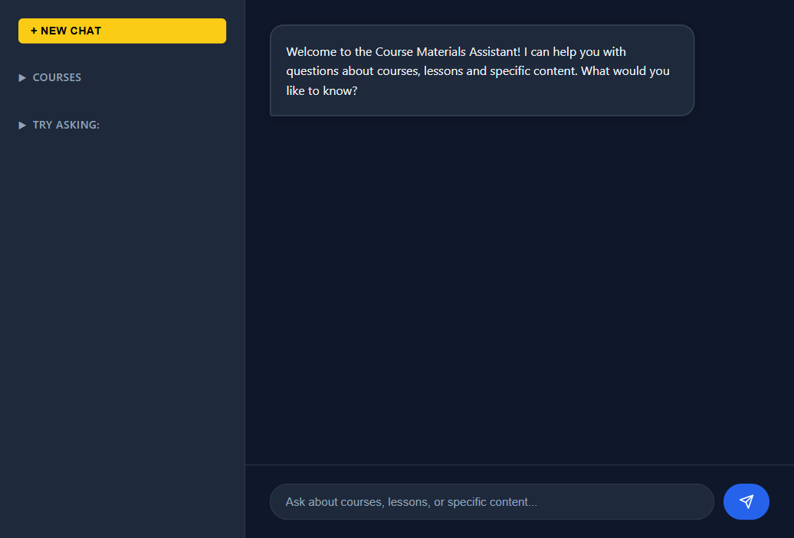

# RAG Course Materials Chatbot

A Retrieval-Augmented Generation chatbot for course materials, powered by the [Claude Agent SDK](https://github.com/anthropics/claude-code/tree/main/packages/sdk). It loads course documents, builds a vector store with ChromaDB, and provides intelligent Q&A with source attribution — all authenticated through your Claude Code subscription (no API key needed).

## Screenshot



## Prerequisites

- **Python 3.13+**
- **[uv](https://docs.astral.sh/uv/)** — Python package manager
- **[Claude Code CLI](https://docs.anthropic.com/en/docs/claude-code)** — installed and authenticated (`npm install -g @anthropic-ai/claude-code`, then `claude` to log in)

## Setup

```bash
git clone https://github.com/alfredang/rag-claude-code-starting.git
cd rag-claude-code-starting
uv sync
```

> **Important:** Do NOT set `ANTHROPIC_API_KEY` in your environment or `.env` file. The Claude Agent SDK authenticates via the Claude Code CLI's OAuth token. Setting an API key will override this and cause errors.

## Running

```bash
./run.sh
```

Or manually:

```bash
cd backend
uv run uvicorn app:app --reload --port 8002
```

Open http://localhost:8002 in your browser.

## How It Works

1. Course documents (`.txt` files in `docs/`) are parsed into sentence-aware chunks and stored in ChromaDB
2. When a user asks a question, the Claude Agent SDK spawns a Claude instance with an MCP server exposing a `search_course_content` tool
3. Claude decides when and how to search the vector store, enabling multi-turn reasoning over results
4. Responses include source links back to specific course lessons

## Adding Course Documents

Place `.txt` files in the `docs/` directory following this format:

```
Course Title: [name]
Course Link: [URL]
Course Instructor: [name]

Lesson 0: [title]
Lesson Link: [URL]
[content...]

Lesson 1: [title]
[content...]
```

Documents are automatically loaded on server startup.

## API Endpoints

| Method | Endpoint | Description |
|--------|----------|-------------|
| `POST` | `/api/query` | Send a question, get an answer with sources |
| `POST` | `/api/new-chat` | Start a new conversation session |
| `GET` | `/api/courses` | Get loaded course stats |

## Tech Stack

- **Claude Agent SDK** — LLM integration via Claude Code CLI OAuth
- **FastAPI** — Backend API server
- **ChromaDB** — Vector database for semantic search
- **Sentence Transformers** (`all-MiniLM-L6-v2`) — Text embeddings
- **Vanilla HTML/JS/CSS** — Frontend (no build step)
